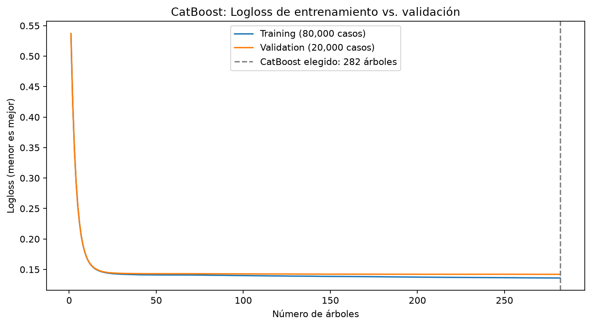

# Probabilidad de default para solicitudes sin historial crediticio

Este proyecto explora cómo estimar la probabilidad de default de una solicitud cuando no se dispone de historial crediticio previo. Usa datos de la competencia Home Credit Credit Risk Model Stability de Kaggle y excluye predictores que describen contratos, pagos o atrasos anteriores.

El objetivo es simular una decisión con información limitada. La tabla de Home Credit no identifica de forma confiable a todos los solicitantes que nunca tuvieron crédito: se quitaron variables, no casos. Por eso, el resultado mide el desempeño en casos de Home Credit bajo ese conjunto reducido de predictores; no demuestra por sí solo el desempeño en una cohorte verificada de personas sin historial crediticio.

## Datos y target

- Fuente: datos de entrenamiento de Home Credit Credit Risk Model Stability, publicados en Kaggle en 2024.
- La unidad de análisis es una solicitud/caso (`case_id`), no necesariamente una persona única.
- La tabla de entrenamiento tiene 1,526,659 casos, con fechas de decisión entre enero de 2019 y octubre de 2020.
- El target binario es `target`: 1 representa el evento de default/riesgo observado por Home Credit; 0, el resultado contrario. Hay 47,994 positivos (3.14%) en toda la tabla.
- Los archivos originales de entrenamiento se combinan por `case_id`: `train_base`, las dos partes de `train_static_0` y el registro del solicitante en `train_person_1` (`num_group1=0`). Los merges se validan como uno a uno.

Este dataset pertenece al contexto de Home Credit y sus casos observados son de 2019–2020. No representa automáticamente a solicitantes de Perú ni a otra población.

## Predictores sin historial previo

El filtro revisó 182 predictores candidatos. Excluyó 110 columnas por señales de historial de crédito/pagos, disponibilidad temporal no confirmada o fechas posteriores a `date_decision`; se conservaron 72 candidatos. Algunas razones se superponen. El proceso conserva las filas y el target.

El modelo comparado finalmente usa 16 predictores:

- Numéricos: `maininc_215A`, `mainoccupationinc_384A`, `credamount_770A`, `annuity_780A`, `numinstls_657L`, `eir_270L`, `downpmt_116A`, `price_1097A`.
- Categóricos: `incometype_1044T`, `empl_employedtotal_800L`, `empl_industry_691L`, `education_927M`, `familystate_447L`, `credtype_322L`, `disbursementtype_67L`.
- `age_years`, calculada con la fecha de nacimiento y `date_decision`.

`case_id`, `target` y las fechas de calendario se mantienen como identificadores, etiqueta o metadatos; no entran como predictores. `target` siempre queda separado de X.

El detalle del filtrado está en [la auditoría de variables](reports/metrics/home_credit_first_credit_filter.md) y en el [CSV de auditoría](reports/metrics/home_credit_first_credit_feature_audit.csv).

## Entrenamiento y evaluación

Se respetó el orden temporal de `WEEK_NUM`:

1. Optuna probó 30 configuraciones por cada modelo de boosting. La búsqueda usó una muestra de 100,000 casos de las semanas 0–50 y semanas 51–60 como validación, con early stopping.
2. Después de elegir hiperparámetros, cada modelo final se ajustó con los casos de las semanas 0–70.
3. La calibración Platt se ajustó con las semanas 71–80.
4. La evaluación temporal fuera de muestra se hizo con las semanas 81–91: 131,548 casos, con una tasa observada de default de 2.12%. Estas semanas no se usaron para entrenar, buscar hiperparámetros ni ajustar la calibración.

Las semanas 81–91 sí se revisaron después para comparar modelos y escenarios de umbral. Por eso reportamos sus resultados como evaluación temporal de desarrollo ya consultada, no como una prueba ciega que nunca influyó en decisiones posteriores.

## Resultados de los modelos calibrados

| Modelo | Average Precision | ROC AUC | Brier | Log Loss |
|---|---:|---:|---:|---:|
| CatBoost Optuna | 0.06373 | 0.70147 | 0.02038 | 0.09656 |
| XGBoost Optuna | 0.06407 | 0.69897 | 0.02036 | 0.09665 |

Las métricas son muy parecidas y no hay un ganador en todas: CatBoost tiene mejor ROC AUC y Log Loss; XGBoost, un Average Precision y Brier apenas mejores. Se deja **CatBoost como champion provisional** por su desempeño ligeramente mejor en ROC AUC y Log Loss y por capturar algo más de los defaults observados en el escenario de umbral revisado. La comparación completa está en [las métricas fuera de tiempo](reports/metrics/home_credit_calibrated_model_comparison.csv).

Con el umbral ilustrativo de 2.5% —aprobar cuando la probabilidad calibrada es menor o igual— CatBoost aprobaría 70.8% de los casos y rechazaría 57.9% de los defaults observados; XGBoost aprobaría 72.3% y rechazaría 56.2%. En las solicitudes aprobadas, la tasa observada de default sería 1.26% y 1.28%, respectivamente. Son resultados retrospectivos de esa muestra, no una política final: para fijar el umbral hace falta definir el costo de aceptar un default y el costo de rechazar a un buen pagador. Ver [todos los escenarios de umbral](reports/home_credit_calibrated_model_threshold_analysis.md).

El [gráfico de Log Loss de entrenamiento y validación](reports/home_credit_catboost_in_period_diagnostic.md) muestra las curvas sobre una división aleatoria estratificada de 100,000 casos de las semanas 0–70. Como ambas líneas se mantienen próximas, no se observa una señal marcada de sobreajuste en esta partición; visualmente, el modelo se comporta de forma similar en los casos de validación que no usó para entrenar. Esta es una comprobación interna, no la evaluación temporal. La evaluación temporal ya se realizó con las semanas 81–91: sus resultados para CatBoost y XGBoost aparecen en la tabla de arriba y en el [CSV comparativo](reports/metrics/home_credit_calibrated_model_comparison.csv).



## Scripts principales

- `scripts/audit_home_credit.py`: inspecciona archivos, target y claves.
- `scripts/build_home_credit_table.py`: crea y valida la tabla de entrenamiento por caso.
- `scripts/filter_home_credit_first_credit.py`: excluye variables de historial crediticio o con disponibilidad temporal no confirmada.
- `scripts/models.py`: baseline de regresión logística.
- `scripts/calibrate_catboost.py` y `scripts/calibrate_xgboost.py`: búsqueda Optuna, ajuste final, calibración y evaluación temporal.
- `scripts/analyze_calibrated_thresholds.py`: compara los escenarios de aprobación de ambos modelos.
- `scripts/diagnose_catboost_in_period.py`: genera el gráfico interno de Log Loss.

## Reproducir

Los archivos de datos de Kaggle no se incluyen en Git. Descarga los Parquet de entrenamiento de la competencia y colócalos en `data/raw/home_credit_2024/`. Instala las dependencias desde la raíz con `python -m pip install -r requirements-home-credit.txt`. Para volver a descargar los datos con `audit_home_credit.py`, copia `.env.example` a `.env` y coloca allí el token de Kaggle; `.env` está excluido de Git.

El flujo de datos y modelado puede ejecutarse con:

```bash
python scripts/audit_home_credit.py
python scripts/build_home_credit_table.py
python scripts/filter_home_credit_first_credit.py
python scripts/models.py
python scripts/calibrate_catboost.py
python scripts/calibrate_xgboost.py
python scripts/analyze_calibrated_thresholds.py
python scripts/diagnose_catboost_in_period.py
```

Los scripts de calibración vuelven a ejecutar Optuna y el entrenamiento. XGBoost está configurado para usar CUDA/GPU.

## Limitaciones

- Excluir predictores de historial no confirma que cada solicitud pertenezca a una persona sin experiencia crediticia.
- Los resultados corresponden a Home Credit y a solicitudes de 2019–2020; se requiere validación con una cohorte real del mercado donde se quiera aplicar el modelo.
- La calibración y el umbral observado pueden cambiar con la prevalencia de default, la población y las condiciones de crédito.
- Este experimento no define por sí mismo una política de aprobación ni sustituye una evaluación de costos, estabilidad por grupos y monitoreo.
